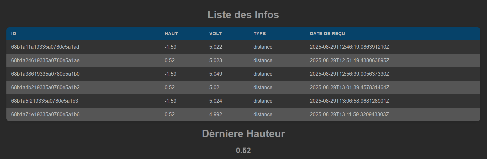

# MQTT

## Install 
```
py -m venv venv
```
```
py -m pip install paho-mqtt
```
```
python -m pip install "pymongo[srv]"
```
```
pip install "fastapi[standard]"
```
```
py -m pip install python-dotenv
```
<br />
<br />
<br />




## getMsg.py
Cette page sert a récuperer les informations du capteur grâce à la librairie paho-mqtt pour ensuite les stocker en BDD avec pymongo. Les informations sont stocker dans un fichier .env ensuite utiliser grâce a la librarie dotenv

## main.py
Cette page permet d'afficher les données récuperer sur la BDD en html grâce à la librairie fastapi